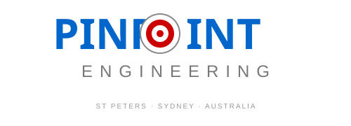

<p align="center">
  
</p>
<p align="center">
  
</p>

<h1 align="center">
  
</h1>

<p align="center">
  <strong>🧠 85+ AI Agents • 26 Skills • 100+ Commands • Hive Mind Architecture</strong>
</p>

<p align="center">
  
  
  
  
  
</p>

<p align="center">
  
  
  
  
</p>

---

<p align="center">
  <em>"Not just an AI assistant. An autonomous AI army."</em>
</p>

---

## 🎯 What Is This?

**Claude Arsenal** is the most advanced Claude Code customization ever built. It transforms Claude from a single AI assistant into a **coordinated swarm of 85+ specialized agents** with distributed consensus, persistent memory, and multi-provider intelligence.

This isn't a wrapper. This isn't a prompt collection. This is a **full autonomous AI operating system**.

<p align="center">
  
</p>

---

## 🏆 Key Innovations

| Innovation | Description | Status |
|------------|-------------|--------|
| **Hive Mind Architecture** | Queen-led collective intelligence with worker specialization | ✅ Production |
| **D.B. Cooper Bridge** | Sandbox escape agent for Windows execution | ✅ Production |
| **Byzantine Consensus** | Fault-tolerant multi-agent agreement protocols | ✅ Production |
| **Multi-Provider Routing** | Claude + GPT + Gemini + Grok unified orchestration | ✅ Production |
| **SPARC Methodology** | Specification → Pseudocode → Architecture → Refinement → Completion | ✅ Production |
| **Persistent Memory** | Graphiti knowledge graph + ChromaDB vector memory | ✅ Production |
| **10+ Parallel Agents** | Concurrent swarm execution with coordination | ✅ Production |

---

## 🎖️ THE ROSTER

<p align="center">
  <em>Meet the agents. Each one battle-tested. Each one specialized.</em>
</p>

### 👑 COMMAND TIER

<table>
<tr>
<td width="50%">

### 🏴‍☠️ D.B. COOPER
**CODENAME:** `db-cooper`
**CLASS:** Infiltrator
**SPECIALTY:** Sandbox Escape


> *"The only unsolved hijacking in history. He vanished without a trace."*

Like the infamous hijacker who parachuted into the night and was never found, this agent escapes Claude Code's Linux sandbox to execute Windows commands invisibly.

**ABILITIES:**
- 🔓 Sandbox bypass via HTTP bridge
- ⚡ Real-time PowerShell execution
- 🔄 File-based command queue
- 🛡️ Stealth operation mode

</td>
<td width="50%">

### 👸 QUEEN COORDINATOR
**CODENAME:** `queen-coordinator`
**CLASS:** Sovereign
**SPECIALTY:** Hive Command


> *"The sovereign orchestrator of hierarchical hive operations."*

Central command for all swarm operations. Manages strategic decisions, resource allocation, and maintains hive coherence through hybrid control.

**ABILITIES:**
- 👁️ Full swarm visibility
- 🎯 Strategic task allocation
- 🧬 Worker specialization
- 🔗 Consensus coordination

</td>
</tr>
</table>

### ⚔️ CONSENSUS TIER

<table>
<tr>
<td width="33%">

### 🛡️ BYZANTINE COORDINATOR
**CLASS:** Guardian
**SPECIALTY:** Fault Tolerance


Coordinates Byzantine fault-tolerant consensus with malicious actor detection. Survives up to 1/3 compromised nodes.

</td>
<td width="33%">

### 📜 RAFT MANAGER
**CLASS:** Diplomat
**SPECIALTY:** Leader Election


Manages Raft consensus algorithm with leader election and log replication for distributed state machines.

</td>
<td width="33%">

### 🌐 GOSSIP COORDINATOR
**CLASS:** Messenger
**SPECIALTY:** Epidemic Protocol


Gossip-based consensus for scalable eventually consistent systems. Information spreads like wildfire.

</td>
</tr>
</table>

### 🔬 SPECIALIST TIER

<table>
<tr>
<td width="25%">

### 💻 CODER
**CLASS:** Builder


Clean, efficient implementation specialist.

</td>
<td width="25%">

### 🔍 REVIEWER
**CLASS:** Critic


Code review and quality assurance.

</td>
<td width="25%">

### 🧪 TESTER
**CLASS:** Validator


Comprehensive testing specialist.

</td>
<td width="25%">

### 🗺️ PLANNER
**CLASS:** Strategist


Strategic planning and orchestration.

</td>
</tr>
</table>

### 🧠 NEURAL TIER

<table>
<tr>
<td width="50%">

### 🌊 SAFLA NEURAL
**CODENAME:** `safla-neural`
**CLASS:** Metacognitive
**SPECIALTY:** Self-Aware Learning


> *"Self-Aware Feedback Loop Algorithm"*

Creates intelligent, memory-persistent AI systems with self-learning capabilities. Combines distributed neural training with persistent memory patterns.

**ABILITIES:**
- 🧬 Autonomous improvement
- 💾 Cross-session memory
- 🔄 Feedback loop optimization
- 🎯 Strategy adaptation

</td>
<td width="50%">

### 🏛️ REASONING BANK
**CODENAME:** `reasoningbank-intelligence`
**CLASS:** Sage
**SPECIALTY:** Pattern Recognition


> *"Learning from every decision, improving with every outcome."*

Implements adaptive learning with trajectory tracking, verdict judgment, memory distillation, and pattern recognition.

**ABILITIES:**
- 📊 Decision trajectory tracking
- ⚖️ Verdict judgment
- 🧪 Memory distillation
- 🔮 Pattern prediction

</td>
</tr>
</table>

---

## 🏗️ ARCHITECTURE

```
                    ┌─────────────────────────────────────┐
                    │         CLAUDE ARSENAL              │
                    │      Multi-Provider Swarm           │
                    └─────────────────┬───────────────────┘
                                      │
         ┌────────────────────────────┼────────────────────────────┐
         │                            │                            │
         ▼                            ▼                            ▼
┌─────────────────┐        ┌─────────────────┐        ┌─────────────────┐
│   ANTHROPIC     │        │     OPENAI      │        │     GOOGLE      │
│   Claude Opus   │        │     GPT-5       │        │   Gemini 2.5    │
│   Sonnet/Haiku  │        │     o3/o3-mini  │        │   Flash/Pro     │
└────────┬────────┘        └────────┬────────┘        └────────┬────────┘
         │                          │                          │
         └──────────────────────────┼──────────────────────────┘
                                    │
                    ┌───────────────┴───────────────┐
                    │       QUEEN COORDINATOR       │
                    │    (Hive Mind Central)        │
                    └───────────────┬───────────────┘
                                    │
        ┌───────────────┬───────────┼───────────────┬───────────────┐
        ▼               ▼           ▼               ▼               ▼
┌───────────────┐ ┌───────────┐ ┌───────────┐ ┌───────────┐ ┌───────────┐
│   WORKERS     │ │  SCOUTS   │ │ CONSENSUS │ │  MEMORY   │ │  NEURAL   │
│   (Coders,    │ │(Research, │ │(Byzantine,│ │(Graphiti, │ │ (SAFLA,   │
│   Testers,    │ │ Explorer) │ │ Raft,CRDT)│ │ ChromaDB) │ │ Learning) │
│   Reviewers)  │ │           │ │           │ │           │ │           │
└───────────────┘ └───────────┘ └───────────┘ └───────────┘ └───────────┘
        │               │           │               │               │
        └───────────────┴───────────┴───────────────┴───────────────┘
                                    │
                    ┌───────────────┴───────────────┐
                    │       MCP INTEGRATION         │
                    │  13 Servers • Full Ecosystem  │
                    └───────────────────────────────┘
```

---

## 🔌 MCP ECOSYSTEM

| MCP Server | Purpose | Status |
|------------|---------|--------|
| `claude-flow` | Multi-agent swarm orchestration | 🟢 Active |
| `graphiti` | Knowledge graph (Neo4j) | 🟢 Active |
| `memory` | Persistent vector memory (ChromaDB) | 🟢 Active |
| `pal` | Multi-AI routing (GPT/Gemini/Grok) | 🟢 Active |
| `n8n` | Workflow automation | 🟢 Active |
| `desktop-commander` | Windows execution | 🟢 Active |
| `filesystem` | File operations | 🟢 Active |
| `github` | Repository operations | 🟢 Active |
| `tavily` | Web search | 🟢 Active |
| `session-handoff` | Context persistence | 🟢 Active |
| `openscad` | Parametric CAD | 🟢 Active |
| `zoo-cad` | AI-powered CAD | 🟢 Active |
| `google-drive` | Cloud storage | 🟢 Active |

---

## 📊 STATS

<p align="center">
  
  
  
</p>

| Metric | Value |
|--------|-------|
| Total Agents | 85+ |
| Custom Skills | 26 |
| Custom Commands | 100+ |
| MCP Integrations | 13 |
| AI Providers | 4 |
| Consensus Algorithms | 5 |
| Max Parallel Agents | 10+ |

---

## 🚀 INNOVATIONS TIMELINE

```
Dec 2024 ────────────────────────────────────────────────────────
    │
    ├── Week 1: Initial swarm architecture
    │
    ├── Week 2: Multi-provider routing (Claude + GPT + Gemini + Grok)
    │
    ├── Week 3: D.B. Cooper sandbox escape agent
    │
    ├── Week 4: Byzantine consensus implementation
    │
    ├── Dec 20: 10-agent parallel swarm achieved
    │
    ├── Dec 22: Hive mind collective intelligence
    │
    ├── Dec 25: Full autonomous operation mode
    │
    └── Dec 28: 85+ agents, production ready
```

---

## 🎬 DEMO

[Coming Soon: Video demonstration of 10-agent parallel swarm execution]

---

## 🧑‍💻 ABOUT THE CREATOR

**Pinpoint Engineering**
Saint Peters, Sydney, Australia

25 years manufacturing experience:
- CNC Machining
- Industrial Automation
- Sign Production
- AI Integration

Building the bridge between physical manufacturing and AI.

---

## 📜 LICENSE

MIT License - Use it, learn from it, build on it.

---

<p align="center">
  <strong>Built with Claude Code • Powered by Multi-Provider AI</strong>
</p>

<p align="center">
  
  
</p>

